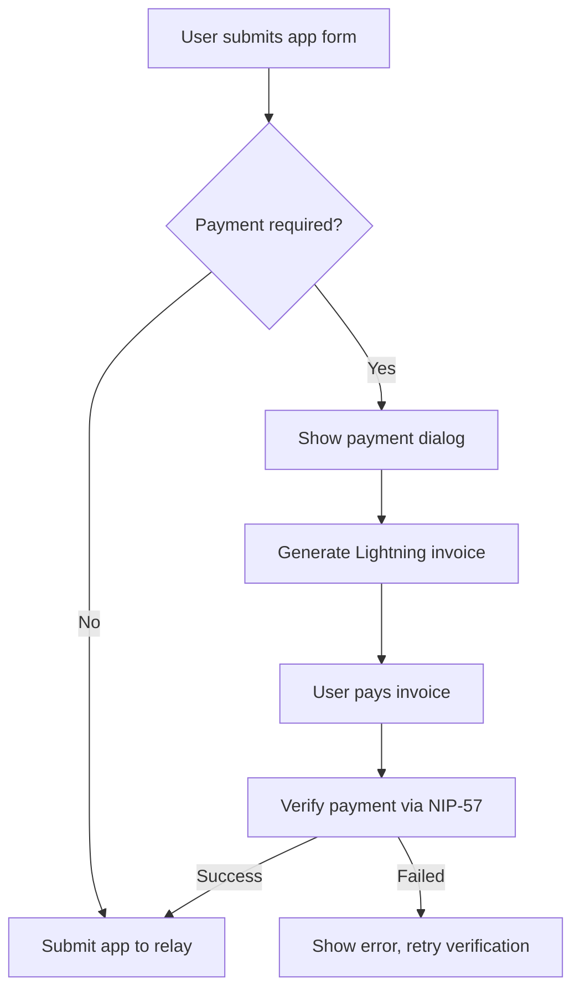

# Lightning Payments for App Submissions

This document describes the lightning payment system implemented for app submissions to prevent spam and maintain quality in the app directory.

## Overview

The system requires a small Lightning Network payment for first-time app submissions while allowing free edits to existing apps. The payment is processed using NIP-57 (Lightning Zaps) for verification.

## Configuration

Add the following environment variables to configure lightning payments:

```bash
# Lightning address that supports NIP-57 (zap receipts) for receiving payments
# Leave empty to disable payment requirement for app submissions
VITE_SUBMIT_APP_LIGHTNING_ADDRESS=payments@example.com

# Fee amount in satoshis for submitting new apps (only applies to new submissions, not edits)
# Set to 0 or leave empty to disable payment requirement
VITE_SUBMIT_APP_FEE=1000
```

## How It Works

### For New Users (First App Submission)
1. User fills out the app submission form
2. If payment is configured and user has no existing apps, payment dialog appears
3. System generates a Lightning invoice using the configured lightning address
4. User pays the invoice using any Lightning wallet or WebLN
5. System verifies payment using NIP-57 zap receipts
6. Once payment is confirmed, the app is submitted to the Nostr network

### For Existing Users (App Edits)
- Users who already have published apps can edit them for free
- No payment is required for updates to existing apps
- Payment is only required for the first app submission per user

## Technical Implementation

### Key Components

1. **`useAppSubmissionPayment` Hook** (`src/hooks/useAppSubmissionPayment.ts`)
   - Manages payment configuration and state
   - Creates Lightning invoices via NIP-57
   - Verifies payments using zap receipts
   - Handles payment flow logic

2. **`AppSubmissionPaymentDialog` Component** (`src/components/AppSubmissionPaymentDialog.tsx`)
   - User interface for the payment process
   - QR code display for Lightning invoices
   - WebLN integration for browser wallets
   - Real-time payment verification status

3. **Enhanced `SubmitAppForm`** (`src/components/SubmitAppForm.tsx`)
   - Integrates payment flow with form submission
   - Checks if user has existing apps to determine payment requirement
   - Shows payment information and handles payment confirmation

### Payment Flow



### NIP-57 Integration

The system uses NIP-57 (Lightning Zaps) for payment verification:

1. **Zap Request Creation**: Creates a proper NIP-57 zap request for the configured lightning address
2. **Invoice Generation**: Requests a Lightning invoice from the zap endpoint
3. **Payment Verification**: Monitors for zap receipts (kind 9735) that confirm payment
4. **Receipt Validation**: Validates zap receipts according to NIP-57 specifications

## User Experience

### Payment Required Notice
When payment is required, users see:
- Clear explanation of the payment requirement
- Amount in satoshis
- Information about free edits after initial submission
- Payment methods (Lightning wallet, WebLN)

### Payment Process
1. **Invoice Creation**: "Creating Payment Invoice" with progress indicator
2. **Payment Display**: QR code and copyable invoice with amount
3. **Verification**: Automatic payment checking every 5 seconds
4. **Confirmation**: Success message and automatic form submission

### Status Messages
The system provides detailed feedback throughout:
- "Connecting to lightning address and generating invoice..."
- "Invoice for X sats created. Pay with any Lightning wallet or WebLN."
- "Checking for payment confirmation..."
- "Payment verified! Now submitting your app..."

## Security Considerations

1. **Lightning Address Validation**: Verifies the lightning address supports NIP-57
2. **Amount Verification**: Confirms payment amount matches the required fee
3. **Receipt Validation**: Validates zap receipts according to NIP-57 specifications
4. **Replay Protection**: Uses unique zap request IDs to prevent replay attacks

## Testing

Run the payment hook tests:
```bash
npm test useAppSubmissionPayment.test.ts
```

The test suite covers:
- Payment configuration validation
- Environment variable handling
- Payment requirement logic
- State management

## Deployment Notes

1. **Lightning Address Setup**: Ensure the configured lightning address supports NIP-57
2. **Relay Configuration**: The system uses the main relay for zap receipt verification
3. **Fee Setting**: Start with a reasonable fee (e.g., 1000 sats) to prevent spam while remaining accessible
4. **Monitoring**: Monitor payment success rates and adjust configuration as needed

## Troubleshooting

### Common Issues

1. **"Lightning address does not support Nostr payments (NIP-57)"**
   - Verify the lightning address supports NIP-57
   - Check the `.well-known/lnurlp` endpoint returns `allowsNostr: true`

2. **"Payment not yet confirmed"**
   - Payment may still be processing
   - Check if the lightning address is properly configured
   - Verify relay connectivity for zap receipt detection

3. **Payment required for existing users**
   - Check if `useAppsByAuthor` is properly detecting existing apps
   - Verify user authentication state

### Debug Mode

Set environment variable for additional logging:
```bash
DEBUG=lightning-payments
```

## Future Enhancements

Potential improvements for the payment system:
- Support for multiple payment methods
- Configurable payment amounts per user tier
- Payment history and receipts
- Automatic refunds for failed submissions
- Integration with other Lightning services
